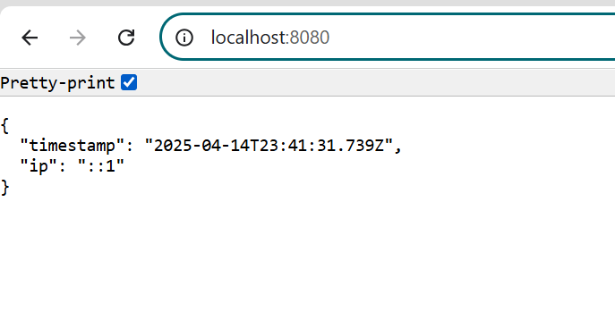
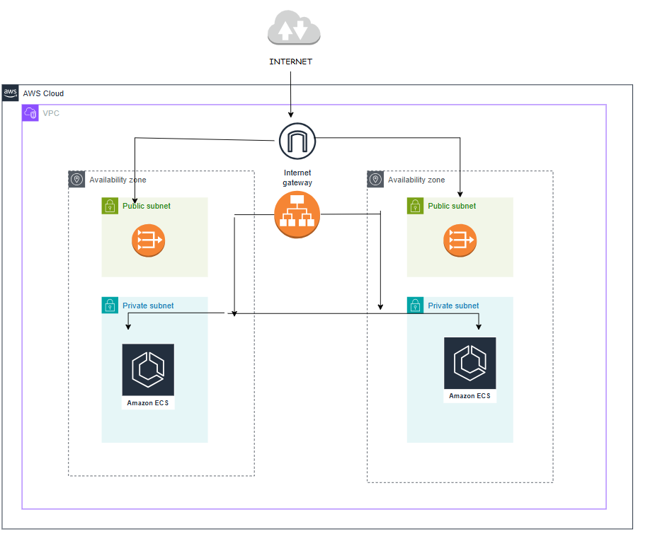

# SimpleTimeService

A minimalist Node.js microservice that returns the current UTC timestamp and the client's IP address in JSON format.

### Docker Public image - chethanasv/simple_time_service:latest

## Setup & Run

### Build the Docker Image

```bash
docker build -t simple-time-service .
```

### Run the Docker Image

```bash
docker run -d -p 8080:8080 simple-time-service
```

### Test the output

Check http://localhost:8080/

### Output



## **Steps to Deploy The Architecture using Terraform**

### Architecture Diagram


1. **Clone the repository**:
   ```bash
   git clone https://github.com/Chethana-22/SimpleTimeService.git
   cd SimpleTimeService
   cd terraform

2. **Initialize Terraform**:
   ```bash
   terraform init

This downloads the required provider plugins and initializes the working directory.

3. **Review the execution plan**:
   ```bash
   terraform plan

This command generates an execution plan, showing the resources that Terraform will create.

4. Apply the configuration:
   ```bash
   terraform apply

Type yes when prompted to confirm the resource creation.
Wait for Terraform to complete provisioning the resources


## **Setting Up the CI/CD Pipeline**


1. **Clone the repository**:
   ```bash
   git clone https://github.com/Chethana-22/SimpleTimeService.git
   cd SimpleTimeService

2. **Configure the Secrets**:

3. **Push Changes to Github**:
   ```bash
   git add . 
   git commit -m "ci-cd changes commit message"
   git push origin main

4. Verify the deployment
